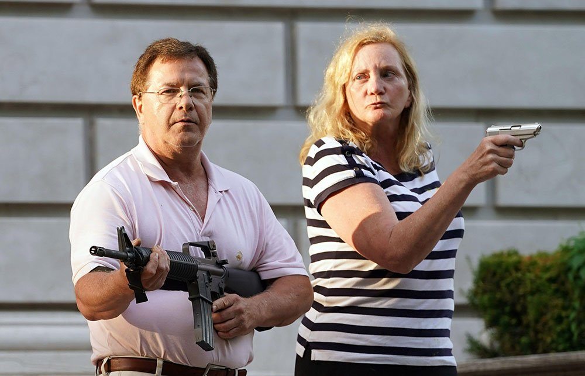
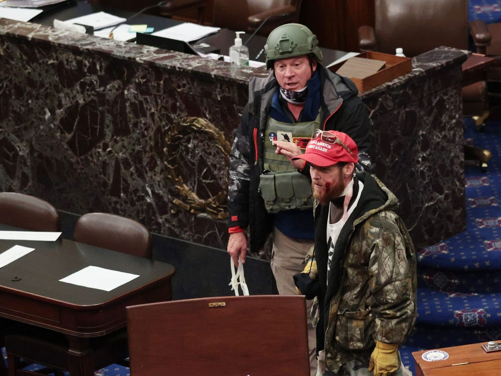

One of the many frustrating things about the current moment is seeing quite clearly in hindsight all the signs that presaged it, and grappling with my inability (or reluctance) back then to prognosticate forward to where we are today. For me personally, certain of the warning signs appeared during a visit last year to my southern home state, which had come to look markedly different in many ways from the place where I grew up.

The main observation was the change of vibe and aesthetic in certain relatives' suburban neighborhood, where a barracks mentality seemed to have taken hold. Just a couple of many examples:

One, the neighbor guy in a army-style camo hat mowing his (already only half-inch tall) grass on an enormous metal beast resembling an Abrams tank. It was far larger and more tricked-out than required for the job, attesting to a need to project not just toughness but *total lawn domination*. (This in keeping with the hyperbolic upsizing of other suburban vehicles like pickup trucks, well exceeding any functional necessity.) This was not the lawn maintenance equipment I'd grown up with; it seemed military-grade, a tool of aggression.

Two, a neighborhood dad out for his afternoon run in a "tactical jogging vest," a new concept to me, and something that would've been the target of jokes in years prior. Not anymore. It was *de rigeur* and deadly serious now. 

Those are a couple of images that stuck in my head. I could go on to talk about things like the abundance of Punisher decals and special forces "operator"-style wraparound shades, along with the many other signifiers of an increasingly normalized paramilitary aesthetic. (These trends are all explored thoroughly and compellingly in Nate Powell's graphic essay, "[About Face](https://popula.com/2019/02/24/about-face/)," a must-read primer on the subject).

Some of this is, of course, the long, slow infusion of the Forever Wars into middle American lifestyles and aesthetics, a.k.a. the militarization of everyday life.

And some of this stems from the phenomenon of masculinity needing to assert itself in reaction to feminizing forces in the culture, compounded by all the domestic comforts of suburbia threatening to siphon its potency.

But it was all, of course, now being drawn out and made more acute by the imagined threat of BLM and Antifa attack squads headed to pillage quiet streets, and accelerated even more by pandemic-driven anxiety and culture clashes.

The McCloskeys, those panicked sentinels wearing Polo and Ann Taylor, clutching semiautomatic weaponry while standing guard at their properties' edge, were just the tip of the spear of a much wider and deeper phenomenon.

Everywhere in Real America you now see not just the "working class," but the suburban petit bourgeoisie LARPing in Special Forces attire, Fox and OAN braying continuously in the background, an assault rifle in every closet.

All that stockpiled gear and all that ginned-up rage, like Chekhov's gun, demands to be used.

So in hindsight, this madness should have come as no surprise. Nor should the entitlement of people who storm the Capitol with their smiling unmasked faces, unconcerned by the hundreds of angles from which they're being recorded. They've been told all their lives that they're the real Americans, and this was *their* country to "take back," their prerogative to assert force.

They, like many in the southern suburb where I stayed, have lived their lives sheltered in relative privilege, never being profiled, never on anyone's watch lists (real terrorists are never so melanin-deficient). They are not just the rustic rabble; they include the owners of a roofing business, a flower shop, and an app development company. 

They also include a realtor (now requesting a presidential pardon) who flew in on a private jet and [used the breach of the Capitol to promote her services in a Facebook livestream](https://www.newsweek.com/jenna-ryan-jet-capitol-riot-asks-donald-trump-pardon-1562087) ("I'm facing a prison sentence. I think I do not deserve that," she now states). They are not rebels against longtime oppression, but reactionaries against the perceived loss of their right to rule.

This is the gated community-dwelling mob, unleashed from the suburban barracks. Looking back, I can see how it was only just a matter of time before it burst forth.